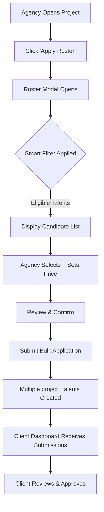

# Multi-Talent Submission System - Complete Architecture

**Version:** 1.0  
**Date:** April 2026  
**Status:** Enterprise Design Document  
**Target:** Agency Dashboard - appagency

---

## 📋 TABLE OF CONTENTS

1. [System Overview](#system-overview)
2. [Database Schema](#database-schema)
3. [Smart Filter Algorithm](#smart-filter-algorithm)
4. [API Reference](#api-reference)
5. [React Component Design](#react-component-design)
6. [TypeScript Types](#typescript-types)
7. [JSON Payloads](#json-payloads)
8. [Impersonation Flow](#impersonation-flow)
9. [UI/UX Specifications](#uiux-specifications)

---

## 🎯 SYSTEM OVERVIEW

### Feature Goals

**Multi-Talent Submission** allows agencies to:
- Browse projects and apply multiple roster talents collectively
- Automatically filter compatible talents using smart matching
- Manage bulk pricing, markup, and agency commission
- Track submission status across multiple talents
- Impersonate talents to complete/update profile data

### Business Logic Flow



### Key Business Rules

1. **Smart Filtering**: Only talents matching project's `casting_requirements` are displayed
2. **Bulk Pricing**: Agency can override individual talent rates inline
3. **Commission Auto-Calc**: System splits revenue based on `agencyCommissionPercent`
4. **Transactional Submit**: All-or-nothing bulk insert for data integrity
5. **Audit Trail**: All submissions tracked via `job_applications` table

---

## 💾 DATABASE SCHEMA

### New/Enhanced Tables

#### 1. `agency_bulk_submissions` (NEW)
Tracks bulk submission batches for auditing and status tracking.

```sql
CREATE TABLE IF NOT EXISTS agency_bulk_submissions (
  id TEXT PRIMARY KEY DEFAULT ('batch_' || lower(hex(randomblob(8)))),
  agencyId TEXT NOT NULL,
  projectId TEXT NOT NULL,
  
  -- Submission Metadata
  totalTalents INTEGER NOT NULL,
  submittedhTalents INTEGER DEFAULT 0,
  approvedCount INTEGER DEFAULT 0,
  rejectedCount INTEGER DEFAULT 0,
  
  -- Financial Summary
  totalProposedRevenue REAL,
  totalAgencyFee REAL,
  totalTalentPayment REAL,
  
  -- Status
  status TEXT DEFAULT 'draft' CHECK(status IN (
    'draft', 'submitted', 'partially_approved', 'all_approved', 
    'all_rejected', 'cancelled'
  )),
  
  -- Timestamps
  createdAt INTEGER DEFAULT (strftime('%s', 'now') * 1000),
  submittedAt INTEGER,
  completedAt INTEGER,
  
  -- Metadata
  notes TEXT,
  submittedBy TEXT, -- User ID of agency member who submitted
  
  FOREIGN KEY (agencyId) REFERENCES agencies(id) ON DELETE CASCADE,
  FOREIGN KEY (projectId) REFERENCES projects(project_id) ON DELETE CASCADE
);

CREATE INDEX idx_bulk_submissions_agency_project ON agency_bulk_submissions(agencyId, projectId);
CREATE INDEX idx_bulk_submissions_status ON agency_bulk_submissions(status);
CREATE INDEX idx_bulk_submissions_createdAt ON agency_bulk_submissions(createdAt DESC);
```

#### 2. `bulk_submission_items` (NEW)
Individual talent records within a bulk submission batch.

```sql
CREATE TABLE IF NOT EXISTS bulk_submission_items (
  id TEXT PRIMARY KEY DEFAULT ('bsi_' || lower(hex(randomblob(8)))),
  batchId TEXT NOT NULL,
  talentId TEXT NOT NULL,
  agencyTalentId TEXT NOT NULL,
  
  -- Submission Details
  roleName TEXT,
  roleId TEXT,
  matchPercentage REAL,
  matchBreakdown TEXT, -- JSON: detailed scoring
  
  -- Pricing Details
  serviceName TEXT NOT NULL, -- From talent_rate_cards
  proposedAmount REAL NOT NULL,
  commissionPercent REAL DEFAULT 15.0,
  agencyFee REAL,
  talentPayment REAL,
  
  -- Status & Response
  itemStatus TEXT DEFAULT 'pending' CHECK(itemStatus IN (
    'pending', 'approved', 'rejected', 'negotiating'
  )),
  clientFeedback TEXT,
  
  -- Linking
  createdProjectTalentId TEXT, -- Foreign key to project_talents after submission
  
  -- Timestamps
  createdAt INTEGER DEFAULT (strftime('%s', 'now') * 1000),
  submittedAt INTEGER,
  respondedAt INTEGER,
  
  FOREIGN KEY (batchId) REFERENCES agency_bulk_submissions(id) ON DELETE CASCADE,
  FOREIGN KEY (talentId) REFERENCES talents(talent_id) ON DELETE CASCADE,
  FOREIGN KEY (agencyTalentId) REFERENCES agency_talents(id) ON DELETE CASCADE,
  FOREIGN KEY (roleId) REFERENCES project_roles(role_id) ON DELETE SET NULL,
  FOREIGN KEY (createdProjectTalentId) REFERENCES project_talents(booking_id) ON DELETE SET NULL
);

CREATE INDEX idx_bulk_items_batch ON bulk_submission_items(batchId);
CREATE INDEX idx_bulk_items_talent ON bulk_submission_items(talentId);
CREATE INDEX idx_bulk_items_status ON bulk_submission_items(itemStatus);
```

#### 3. Enhance `project_roles` (existing)
Add requirements data:

```sql
ALTER TABLE project_roles ADD COLUMN IF NOT EXISTS 
  castingRequirementsId TEXT REFERENCES casting_requirements(id) ON DELETE SET NULL;
```

### Data Model Relationships

```
agencies (1) ──── (N) agency_bulk_submissions (1) ──── (N) bulk_submission_items
                           │                                      │
                           └──> projects                  ├──> talents
                                                          ├──> agency_talents
                                                          └──> project_roles
```

---

## 🧠 SMART FILTER ALGORITHM

### Phase 1: Hard Filters (Mandatory)

Hard filters **MUST** be met; talent excluded if any fail.

```pseudocode
FUNCTION applyHardFilters(talent: TalentProfile, requirements: CastingRequirements): BOOLEAN
  
  // Hard Filter 1: Gender
  IF requirements.required_gender != NULL
    IF talent.gender != requirements.required_gender
      RETURN FALSE (REASON: "Gender mismatch")
  
  // Hard Filter 2: Age Range
  talent_age = calculateAge(talent.dateOfBirth)
  IF talent_age < requirements.required_age_min OR 
     talent_age > requirements.required_age_max
    RETURN FALSE (REASON: "Age out of range")
  
  // Hard Filter 3: Hard Skills Required
  required_skills = JSON.parse(requirements.required_skills)
  talent_skills = JSON.parse(talent.skills_json)
  
  FOR EACH skill IN required_skills
    IF skill NOT IN talent_skills
      RETURN FALSE (REASON: "Missing required skill: {skill}")
  
  // Hard Filter 4: Location Preference
  IF requirements.required_location_pref == "Jakarta_only"
    IF extractCity(talent.domicile) != "Jakarta"
      RETURN FALSE (REASON: "Location mismatch - must be Jakarta")
  
  RETURN TRUE
END FUNCTION
```

### Phase 2: Soft Filters (Scoring)

Soft filters produce a **match_score** (0-100). Used for ranking.

```pseudocode
FUNCTION calculateMatchScore(talent: TalentProfile, requirements: CastingRequirements): FLOAT
  
  score = 0.0
  weights = {
    height: 15,        // ± 5cm = 100%, ±10cm = 50%
    physique: 15,      // Height/weight ratio
    skills: 20,        // Partial skill match bonus
    languages: 10,     // Bonus for additional languages
    availability: 15,  // Schedule overlap
    profile_quality: 15 // Profile completeness
    rate_alignment: 10  // Within budget range
  }
  
  // Height Match (±5cm tolerance = 100%, ±10cm = 50%)
  height_diff = ABS(talent.height_cm - requirements.height_preferred_cm)
  IF height_diff <= 5
    height_score = 100
  ELSE IF height_diff <= 10
    height_score = 50
  ELSE
    height_score = 0
  
  score += (height_score / 100) * weights.height
  
  // Physique (BMI within range)
  talent_bmi = talent.weight_kg / ((talent.height_cm / 100) ^ 2)
  ideal_bmi = requirements.bmi_min + (requirements.bmi_max - requirements.bmi_min) / 2
  bmi_diff = ABS(talent_bmi - ideal_bmi)
  
  IF bmi_diff <= 1.0
    physique_score = 100
  ELSE IF bmi_diff <= 3.0
    physique_score = 70
  ELSE
    physique_score = 30
  
  score += (physique_score / 100) * weights.physique
  
  // Skills Matching
  required_skills = JSON.parse(requirements.required_skills)
  talent_skills = JSON.parse(talent.skills_json)
  skill_match_count = 0
  
  FOR EACH req_skill IN required_skills
    IF req_skill IN talent_skills
      skill_match_count++
  
  skill_match_percent = (skill_match_count / LENGTH(required_skills)) * 100
  score += (skill_match_percent / 100) * weights.skills
  
  // Language Bonus
  required_langs = JSON.parse(requirements.required_languages)
  talent_langs = JSON.parse(talent.languages_json)
  lang_bonus_count = 0
  
  FOR EACH lang IN required_langs
    IF lang IN talent_langs
      lang_bonus_count++
  
  lang_bonus = (lang_bonus_count / MAX(1, LENGTH(required_langs))) * 100
  score += (lang_bonus / 100) * weights.languages
  
  // Availability Match
  project_dates = [requirements.shoot_date_start, requirements.shoot_date_end]
  talent_availability = getTalentAvailabilityStatus(talent.id, project_dates)
  
  IF talent_availability == "fully_available"
    avail_score = 100
  ELSE IF talent_availability == "partially_available"
    avail_score = 60
  ELSE
    avail_score = 0
  
  score += (avail_score / 100) * weights.availability
  
  // Profile Quality
  profile_completion = talent.profile_completion_percent
  score += (profile_completion / 100) * weights.profile_quality
  
  // Rate Alignment
  IF talent.rate_daily_min <= requirements.budget_max AND
     talent.rate_daily_max >= requirements.budget_min
    rate_score = 100
  ELSE IF overlap exists (partial budget alignment)
    rate_score = 50
  ELSE
    rate_score = 10
  
  score += (rate_score / 100) * weights.rate_alignment
  
  RETURN CLAMP(score, 0, 100)
END FUNCTION
```

### Phase 3: Filter Orchestration

```pseudocode
FUNCTION filterRosterForProject(
  agencyId: STRING,
  projectId: STRING
): FilteredRoster

  // 1. Fetch project's casting requirements
  requirements = getCastingRequirements(projectId)
  
  // 2. Fetch all active agency talents
  all_talents = getAgencyTalents(agencyId, status: "active")
  
  // 3. Apply hard filters first (O(n) pass)
  eligible_talents = []
  failed_talents = []
  
  FOR EACH talent IN all_talents
    hard_filter_result = applyHardFilters(talent, requirements)
    
    IF hard_filter_result.passed
      talent_with_score = {
        ...talent,
        match_score: calculateMatchScore(talent, requirements),
        match_details: hard_filter_result.details
      }
      eligible_talents.push(talent_with_score)
    ELSE
      failed_talents.push({
        talentId: talent.id,
        failureReason: hard_filter_result.reason,
        talents: talent
      })
  
  // 4. Sort eligible by match score (descending)
  eligible_talents = SORT BY match_score DESC
  
  // 5. Return with metadata
  RETURN {
    total_roster_count: LENGTH(all_talents),
    eligible_count: LENGTH(eligible_talents),
    ineligible_count: LENGTH(failed_talents),
    eligible_talents: eligible_talents,
    ineligible_details: failed_talents,
    requirements_applied: requirements,
    generated_at: NOW()
  }
END FUNCTION
```

### Implementation Notes

- **Phase 1 (Hard Filters)**: O(n) complexity, early termination
- **Phase 2 (Scoring)**: Only runs on eligible candidates
- **Caching**: Results cached for 30 minutes (project rarely changes within hour)
- **Real-time Updates**: If talent profile updated, invalidate cache for that talent

---

## 🔌 API REFERENCE

### 1. GET `/api/agency/roster?project_id={id}`

Fetch eligible roster talents for a specific project.

**Request:**
```http
GET /api/agency/roster?project_id=proj_abc123
Authorization: Bearer {agencyToken}
```

**Response (200 OK):**
```json
{
  "success": true,
  "data": {
    "projectId": "proj_abc123",
    "projectName": "Nike - Summer Campaign",
    "totalRosterCount": 45,
    "eligibleCount": 18,
    "ineligibleCount": 27,
    "candidates": [
      {
        "id": "talent_001",
        "agencyTalentId": "agencytalent_abc",
        "name": "Budi Santoso",
        "profiles": {
          "gender": "male",
          "age": 28,
          "height_cm": 182,
          "weight_kg": 75,
          "skills": ["model_commercial", "mc", "actor"]
        },
        "matchScore": 92,
        "matchBreakdown": {
          "height": 15,
          "physique": 15,
          "skills": 18,
          "languages": 8,
          "availability": 15,
          "profileQuality": 15,
          "rateAlignment": 6
        },
        "rateCard": {
          "serviceName": "Commercial Model",
          "dailyRateMin": 1500000,
          "dailyRateMax": 3000000,
          "baseCurrency": "IDR"
        },
        "availability": {
          "status": "available",
          "conflicts": []
        },
        "profileQuality": 95
      }
      // ... more candidates
    ],
    "ineligibleReasons": [
      {
        "talentId": "talent_099",
        "name": "Citra Dewi",
        "reason": "Gender requirement: Female required, candidate is Male"
      }
      // ... more ineligible
    ],
    "requirements": {
      "gender": "male",
      "ageMin": 25,
      "ageMax": 35,
      "heightMin": 175,
      "heightMax": 190,
      "requiredSkills": ["model_commercial", "mc"],
      "budgetMin": 2000000,
      "budgetMax": 5000000
    }
  }
}
```

**Response (400 Bad Request):**
```json
{
  "success": false,
  "error": "PROJECT_NOT_FOUND",
  "message": "Project proj_xyz not found"
}
```

---

### 2. POST `/api/agency/projects/apply-bulk`

Submit multiple talents to a project (main endpoint).

**Request:**
```http
POST /api/agency/projects/apply-bulk
Authorization: Bearer {agencyToken}
Content-Type: application/json
```

**Body:**
```json
{
  "projectId": "proj_abc123",
  "batchNotes": "Summer Campaign - Wave 1 Submissions",
  "submissions": [
    {
      "talentId": "talent_001",
      "agencyTalentId": "agencytalent_abc",
      "roleName": "Lead Model",
      "roleId": "role_model_001",
      "matchScore": 92,
      "matchBreakdown": {
        "height": 15,
        "physique": 15,
        "skills": 18,
        "languages": 8,
        "availability": 15,
        "profileQuality": 15,
        "rateAlignment": 6
      },
      "pricing": {
        "serviceName": "Commercial Model - Full Day",
        "proposedAmount": 2500000,
        "currency": "IDR",
        "agencyMarkupPercent": 15,
        "agencyCommissionPercent": 20
      }
    },
    {
      "talentId": "talent_002",
      "agencyTalentId": "agencytalent_xyz",
      "roleName": "Secondary Model",
      "roleId": "role_model_002",
      "matchScore": 85,
      "matchBreakdown": {
        "height": 13,
        "physique": 14,
        "skills": 16,
        "languages": 7,
        "availability": 15,
        "profileQuality": 12,
        "rateAlignment": 8
      },
      "pricing": {
        "serviceName": "Commercial Model - Half Day",
        "proposedAmount": 1800000,
        "currency": "IDR",
        "agencyMarkupPercent": 15,
        "agencyCommissionPercent": 20
      }
    }
  ]
}
```

**Response (201 Created):**
```json
{
  "success": true,
  "data": {
    "batchId": "batch_def456",
    "projectId": "proj_abc123",
    "agencyId": "agency_xyz",
    "submittedAt": 1712700000000,
    "totalSubmissions": 2,
    "submissionStatuses": [
      {
        "itemId": "bsi_001",
        "talentId": "talent_001",
        "talentName": "Budi Santoso",
        "status": "submitted",
        "projectTalentId": "booking_abc001",
        "proposedAmount": 2500000,
        "agencyFee": 500000,
        "talentPayment": 2000000
      },
      {
        "itemId": "bsi_002",
        "talentId": "talent_002",
        "talentName": "Ella Singh",
        "status": "submitted",
        "projectTalentId": "booking_abc002",
        "proposedAmount": 1800000,
        "agencyFee": 360000,
        "talentPayment": 1440000
      }
    ],
    "financialSummary": {
      "totalProposedRevenue": 4300000,
      "totalAgencyFee": 860000,
      "totalTalentPayment": 3440000,
      "currency": "IDR"
    },
    "nextSteps": [
      "Client will review submissions within 24 hours",
      "You can track status in 'Submissions' tab"
    ]
  }
}
```

**Response (422 Unprocessable Entity):**
```json
{
  "success": false,
  "error": "VALIDATION_ERROR",
  "details": [
    {
      "index": 0,
      "talentId": "talent_099",
      "error": "INELIGIBLE_FOR_PROJECT",
      "reason": "Talent does not meet project requirements (Gender mismatch)"
    }
  ]
}
```

---

### 3. GET `/api/agency/submissions`

Track all bulk submissions and their status.

**Request:**
```http
GET /api/agency/submissions?status=submitted&sort=-submittedAt
Authorization: Bearer {agencyToken}
```

**Query Parameters:**
- `status`: `draft|submitted|partially_approved|all_approved|all_rejected|cancelled`
- `projectId`: Filter by specific project (optional)
- `sort`: `-submittedAt` (default) or `-totalTalents`
- `limit`: 50 (default), max 200
- `offset`: 0 (default) for pagination

**Response (200 OK):**
```json
{
  "success": true,
  "data": {
    "total": 12,
    "submissions": [
      {
        "batchId": "batch_def456",
        "projectId": "proj_abc123",
        "projectName": "Nike - Summer Campaign",
        "status": "submitted",
        "submittedAt": 1712700000000,
        "totalTalents": 2,
        "approvedCount": 1,
        "rejectedCount": 0,
        "pendingCount": 1,
        "financialSummary": {
          "totalProposedRevenue": 4300000,
          "totalAgencyFee": 860000,
          "totalTalentPayment": 3440000
        },
        "items": [
          {
            "itemId": "bsi_001",
            "talentName": "Budi Santoso",
            "proposedAmount": 2500000,
            "itemStatus": "approved",
            "clientFeedback": "Perfect fit, confirmed booking"
          },
          {
            "itemId": "bsi_002",
            "talentName": "Ella Singh",
            "proposedAmount": 1800000,
            "itemStatus": "pending",
            "clientFeedback": null
          }
        ]
      }
      // ... more submissions
    ]
  }
}
```

---

### 4. GET `/api/agency/submissions/{batchId}/details`

Get detailed view of a specific batch.

**Response:**
```json
{
  "success": true,
  "data": {
    "batch": {
      "batchId": "batch_def456",
      "projectId": "proj_abc123",
      "status": "submitted",
      "submittedAt": 1712700000000,
      "totalTalents": 2
    },
    "items": [
      {
        "itemId": "bsi_001",
        "talentId": "talent_001",
        "talentName": "Budi Santoso",
        "profilePhoto": "https://cdn.orland.com/budi.jpg",
        "matchScore": 92,
        "status": "approved",
        "pricing": {
          "proposedAmount": 2500000,
          "agencyFee": 500000,
          "talentPayment": 2000000
        },
        "timeline": {
          "submittedAt": 1712700000000,
          "approvedAt": 1712750000000,
          "approvalDuration": "14 hours"
        }
      }
    ]
  }
}
```

---

### 5. POST `/api/agency/impersonate/start`

Initialize impersonation session for a talent.

**Request:**
```json
{
  "talentId": "talent_001",
  "reason": "update_comp_card"
}
```

**Response (201 Created):**
```json
{
  "success": true,
  "data": {
    "impersonationSessionId": "imp_xyz789",
    "talentId": "talent_001",
    "talentName": "Budi Santoso",
    "impersonationToken": "eyJhbGciOiJIUzI1NiIsInR5cCI6IkpXVCJ9...",
    "expiresIn": 3600,
    "redirectUrl": "https://talent.orlandmanagement.com?token=eyJhbGc..."
  }
}
```

---

## ⚛️ REACT COMPONENT DESIGN

### Component Architecture

```
<MultiTalentSubmissionFlow />
  ├── <ProjectSelector />
  ├── <RosterFilterModal />
  │   ├── <SmartFilterOverview />
  │   ├── <TalentSelectionTable />
  │   │   ├── <TableHeader />
  │   │   ├── <TableRow /> (Repeating)
  │   │   │   ├── <CheckboxCell />
  │   │   │   ├── <TalentInfoCell />
  │   │   │   ├── <MatchScoreCell />
  │   │   │   ├── <PricingCell /> (Editable)
  │   │   │   └── <ActionCell />
  │   │   └── <TableFooter />
  │   └── <ModalActions />
  ├── <ReviewPanel />
  │   ├── <FinancialSummary />
  │   ├── <ValidationWarnings />
  │   └── <SubmitButton />
  └── <SubmissionConfirmation />
      ├── <SuccessMessage />
      ├── <FinancialBreakdown />
      └── <NextSteps />
```

### Component: `TalentSelectionTable`

```typescript
import React, { useMemo, useState } from 'react'
import { formatCurrency } from '@/lib/utils'
import { TalentCandidate } from '@/types/agency'

interface Props {
  candidates: TalentCandidate[]
  selectedTalents: Set<string>
  onSelectionChange: (talentId: string, selected: boolean) => void
  onPricingChange: (talentId: string, newPrice: number, serviceName: string) => void
  agencyCommissionPercent: number
  loading?: boolean
}

export const TalentSelectionTable = ({
  candidates,
  selectedTalents,
  onSelectionChange,
  onPricingChange,
  agencyCommissionPercent,
  loading = false,
}: Props) => {
  const [hoveredRow, setHoveredRow] = useState<string | null>(null)
  const [editingPriceId, setEditingPriceId] = useState<string | null>(null)

  const selectedCount = selectedTalents.size
  const selectedTotal = useMemo(() => {
    return candidates
      .filter(c => selectedTalents.has(c.id))
      .reduce((sum, c) => sum + (c.pricing.proposedAmount || 0), 0)
  }, [candidates, selectedTalents])

  if (loading) {
    return (
      <div className="flex items-center justify-center py-12">
        <LoadingSpinner message="Loading eligible candidates..." />
      </div>
    )
  }

  return (
    <div className="space-y-4">
      {/* Header Stats */}
      <div className="flex justify-between items-center px-1 py-2 border-b border-gold/20">
        <p className="text-sm text-gray-400">
          {selectedCount} of {candidates.length} selected
        </p>
        <p className="text-sm font-mono text-gold">
          Total: {formatCurrency(selectedTotal, 'IDR')}
        </p>
      </div>

      {/* Table */}
      <div className="overflow-x-auto rounded-xl bg-black/40 backdrop-blur-xl border border-gold/10">
        <table className="w-full text-sm">
          <thead>
            <tr className="border-b border-gold/20 bg-gradient-to-r from-black/60 to-black/20">
              <th className="px-4 py-3 text-left font-semibold text-gray-200 w-12">
                <input
                  type="checkbox"
                  checked={selectedCount === candidates.length && candidates.length > 0}
                  onChange={(e) => {
                    candidates.forEach(c => onSelectionChange(c.id, e.target.checked))
                  }}
                  className="w-5 h-5 rounded border-gold/30 bg-black/30 cursor-pointer"
                />
              </th>
              <th className="px-4 py-3 text-left font-semibold text-gray-200">Talent</th>
              <th className="px-4 py-3 text-center font-semibold text-gray-200">Match %</th>
              <th className="px-4 py-3 text-left font-semibold text-gray-200">Service</th>
              <th className="px-4 py-3 text-right font-semibold text-gold">Proposed Rate</th>
              <th className="px-4 py-3 text-right font-semibold text-gray-200">Agency Fee</th>
            </tr>
          </thead>
          <tbody>
            {candidates.map((talent) => {
              const isSelected = selectedTalents.has(talent.id)
              const isHovered = hoveredRow === talent.id
              const agencyFee = talent.pricing.proposedAmount * (agencyCommissionPercent / 100)
              const talentPayment = talent.pricing.proposedAmount - agencyFee

              return (
                <tr
                  key={talent.id}
                  onMouseEnter={() => setHoveredRow(talent.id)}
                  onMouseLeave={() => setHoveredRow(null)}
                  className={`border-b border-gold/5 transition-all ${
                    isSelected ? 'bg-gold/5' : isHovered ? 'bg-black/30' : 'hover:bg-black/20'
                  }`}
                >
                  {/* Checkbox */}
                  <td className="px-4 py-3">
                    <input
                      type="checkbox"
                      checked={isSelected}
                      onChange={(e) => onSelectionChange(talent.id, e.target.checked)}
                      className="w-5 h-5 rounded border-gold/30 bg-black/30 cursor-pointer accent-gold"
                    />
                  </td>

                  {/* Talent Info */}
                  <td className="px-4 py-3">
                    <div className="flex items-center gap-3">
                      
                      <div>
                        <p className="font-medium text-white">{talent.name}</p>
                        <p className="text-xs text-gray-400">
                          {talent.profiles.age}y • {talent.profiles.height_cm}cm
                        </p>
                      </div>
                    </div>
                  </td>

                  {/* Match Score */}
                  <td className="px-4 py-3 text-center">
                    <div className="flex items-center justify-center gap-2">
                      <div className="relative w-12 h-12">
                        <svg className="w-12 h-12" viewBox="0 0 36 36">
                          <circle
                            cx="18"
                            cy="18"
                            r="16"
                            fill="none"
                            stroke="#ffffff"
                            strokeWidth="2"
                            opacity="0.1"
                          />
                          <circle
                            cx="18"
                            cy="18"
                            r="16"
                            fill="none"
                            stroke="#D4AF37"
                            strokeWidth="2"
                            strokeDasharray={`${(talent.matchScore / 100) * 100.5} 100.5`}
                            strokeLinecap="round"
                          />
                        </svg>
                        <span className="absolute inset-0 flex items-center justify-center text-xs font-bold text-gold">
                          {Math.round(talent.matchScore)}
                        </span>
                      </div>
                    </div>
                  </td>

                  {/* Service Name */}
                  <td className="px-4 py-3">
                    <span className="text-xs font-medium px-2 py-1 rounded-md bg-black/40 text-gray-300 border border-gold/10">
                      {talent.pricing.serviceName}
                    </span>
                  </td>

                  {/* Pricing (Editable) */}
                  <td className="px-4 py-3 text-right">
                    {editingPriceId === talent.id ? (
                      <input
                        type="number"
                        value={talent.pricing.proposedAmount}
                        onChange={(e) => {
                          onPricingChange(
                            talent.id,
                            parseFloat(e.target.value),
                            talent.pricing.serviceName
                          )
                        }}
                        onBlur={() => setEditingPriceId(null)}
                        onKeyDown={(e) => {
                          if (e.key === 'Enter') setEditingPriceId(null)
                        }}
                        className="w-full px-3 py-2 rounded-lg bg-gold/10 border border-gold/50 text-gold font-mono text-sm focus:outline-none focus:ring-2 focus:ring-gold/50"
                        autoFocus
                      />
                    ) : (
                      <button
                        onClick={() => setEditingPriceId(talent.id)}
                        className="font-mono text-gold hover:text-gold/80 transition-colors"
                      >
                        {formatCurrency(talent.pricing.proposedAmount, 'IDR')}
                      </button>
                    )}
                  </td>

                  {/* Agency Fee */}
                  <td className="px-4 py-3 text-right text-gray-400 font-mono text-xs">
                    {formatCurrency(agencyFee, 'IDR')}
                  </td>
                </tr>
              )
            })}
          </tbody>
        </table>
      </div>

      {/* Empty State */}
      {candidates.length === 0 && (
        <div className="text-center py-8 text-gray-400">
          <p>No eligible talents found for this project</p>
          <p className="text-xs text-gray-500 mt-1">Check project requirements and roster profiles</p>
        </div>
      )}
    </div>
  )
}
```

### Component: `FinancialSummary`

```typescript
interface Props {
  submissions: BulkSubmissionItem[]
  agencyCommissionPercent: number
}

export const FinancialSummary = ({ submissions, agencyCommissionPercent }: Props) => {
  const totalProposedRevenue = submissions.reduce((sum, s) => sum + s.pricing.proposedAmount, 0)
  const totalAgencyFee = submissions.reduce((sum, s) => sum + s.pricing.agencyFee, 0)
  const totalTalentPayment = submissions.reduce((sum, s) => sum + s.pricing.talentPayment, 0)

  return (
    <div className="rounded-xl bg-gradient-to-br from-black/40 to-black/20 backdrop-blur-xl border border-gold/20 p-6 space-y-6">
      <h3 className="text-lg font-semibold text-white">Financial Breakdown</h3>

      {/* Summary Cards */}
      <div className="grid grid-cols-3 gap-4">
        <div className="rounded-lg bg-black/60 border border-gold/10 p-4">
          <p className="text-xs text-gray-400 mb-1">Total Proposed</p>
          <p className="text-2xl font-bold text-gold">{formatCurrency(totalProposedRevenue, 'IDR')}</p>
        </div>
        <div className="rounded-lg bg-black/60 border border-green-500/10 p-4">
          <p className="text-xs text-gray-400 mb-1">Talent Payment</p>
          <p className="text-2xl font-bold text-green-400">{formatCurrency(totalTalentPayment, 'IDR')}</p>
        </div>
        <div className="rounded-lg bg-black/60 border border-gold/20 p-4">
          <p className="text-xs text-gray-400 mb-1">Agency Fee</p>
          <p className="text-2xl font-bold text-gold">{formatCurrency(totalAgencyFee, 'IDR')}</p>
        </div>
      </div>

      {/* Revenue Split Visualization */}
      <div className="space-y-2">
        <p className="text-xs text-gray-400">Revenue Split</p>
        <div className="flex gap-2 h-8 rounded-lg overflow-hidden">
          <div
            className="bg-green-500/60 flex items-center justify-center text-xs font-bold text-white"
            style={{ width: `${(totalTalentPayment / totalProposedRevenue) * 100}%` }}
          >
            {Math.round((totalTalentPayment / totalProposedRevenue) * 100)}%
          </div>
          <div
            className="bg-gold/60 flex items-center justify-center text-xs font-bold text-black"
            style={{ width: `${(totalAgencyFee / totalProposedRevenue) * 100}%` }}
          >
            {Math.round((totalAgencyFee / totalProposedRevenue) * 100)}%
          </div>
        </div>
        <div className="flex justify-between text-xs text-gray-400">
          <span>Talent: {Math.round((totalTalentPayment / totalProposedRevenue) * 100)}%</span>
          <span>Agency: {Math.round((totalAgencyFee / totalProposedRevenue) * 100)}%</span>
        </div>
      </div>

      {/* Commission Info */}
      <div className="pt-4 border-t border-gold/10">
        <p className="text-xs text-gray-400 mb-2">Commission Structure</p>
        <p className="text-sm text-gold font-mono">{agencyCommissionPercent}% agency commission</p>
      </div>
    </div>
  )
}
```

---

## 📘 TYPESCRIPT TYPES

```typescript
// types/agency.ts

export interface TalentCandidate {
  id: string
  agencyTalentId: string
  name: string
  profiles: {
    gender: 'male' | 'female' | 'non-binary'
    age: number
    height_cm: number
    weight_kg: number
    skills: string[]
    profilePhoto?: string
    domicile: string
  }
  matchScore: number
  matchBreakdown: MatchScoreBreakdown
  rateCard: {
    serviceName: string
    dailyRateMin: number
    dailyRateMax: number
    baseCurrency: string
  }
  availability: {
    status: 'available' | 'partially_available' | 'unavailable'
    conflicts: DateRange[]
  }
  profileQuality: number
  pricing: {
    serviceName: string
    proposedAmount: number
    agencyMarkupPercent: number
    agencyCommissionPercent: number
    agencyFee: number
    talentPayment: number
  }
}

export interface MatchScoreBreakdown {
  height: number
  physique: number
  skills: number
  languages: number
  availability: number
  profileQuality: number
  rateAlignment: number
}

export interface BulkSubmissionItem {
  itemId: string
  talentId: string
  agencyTalentId: string
  roleName: string
  roleId: string
  matchScore: number
  matchBreakdown: MatchScoreBreakdown
  pricing: {
    serviceName: string
    proposedAmount: number
    currency: string
    agencyMarkupPercent: number
    agencyCommissionPercent: number
    agencyFee: number
    talentPayment: number
  }
  status: 'pending' | 'approved' | 'rejected' | 'negotiating'
  clientFeedback?: string
}

export interface BulkSubmissionPayload {
  projectId: string
  batchNotes: string
  submissions: BulkSubmissionItem[]
}

export interface AgencyBulkSubmission {
  batchId: string
  projectId: string
  projectName: string
  status: 'draft' | 'submitted' | 'partially_approved' | 'all_approved' | 'all_rejected' | 'cancelled'
  submittedAt: number
  totalTalents: number
  approvedCount: number
  rejectedCount: number
  pendingCount: number
  financialSummary: {
    totalProposedRevenue: number
    totalAgencyFee: number
    totalTalentPayment: number
  }
  items: BulkSubmissionItem[]
}

export interface FilteredRoster {
  totalRosterCount: number
  eligibleCount: number
  ineligibleCount: number
  candidates: TalentCandidate[]
  ineligibleDetails: IneligibleTalent[]
  requirements: CastingRequirements
  generatedAt: number
}

export interface IneligibleTalent {
  talentId: string
  name: string
  reason: string
}

export interface CastingRequirements {
  gender?: 'male' | 'female' | 'non-binary'
  ageMin: number
  ageMax: number
  heightMin: number
  heightMax: number
  requiredSkills: string[]
  requiredLanguages: string[]
  budgetMin: number
  budgetMax: number
  shootDateStart: string
  shootDateEnd: string
  locationPref: 'jakarta_only' | 'flexible' | 'multiple_cities'
  specialRequirements?: string
}

export interface ImpersonationSession {
  impersonationSessionId: string
  talentId: string
  talentName: string
  impersonationToken: string
  expiresIn: number
  redirectUrl: string
}
```

---

## 📦 JSON PAYLOADS

### Request: Bulk Application

```json
{
  "projectId": "proj_nike_summer_2026",
  "batchNotes": "Initial submission - Wave 1 Male Models (25-35y)",
  "submissions": [
    {
      "talentId": "talent_budi_001",
      "agencyTalentId": "agencytalent_abc123",
      "roleName": "Lead Model",
      "roleId": "role_lead_model_001",
      "matchScore": 92.5,
      "matchBreakdown": {
        "height": 15,
        "physique": 15,
        "skills": 18,
        "languages": 8,
        "availability": 15,
        "profileQuality": 14,
        "rateAlignment": 7
      },
      "pricing": {
        "serviceName": "Commercial Model - Full Day (8 hours)",
        "proposedAmount": 2500000,
        "currency": "IDR",
        "agencyMarkupPercent": 15,
        "agencyCommissionPercent": 20
      }
    },
    {
      "talentId": "talent_Ella_002",
      "agencyTalentId": "agencytalent_def456",
      "roleName": "Background Model",
      "roleId": "role_bg_model_001",
      "matchScore": 78.0,
      "matchBreakdown": {
        "height": 12,
        "physique": 13,
        "skills": 14,
        "languages": 6,
        "availability": 15,
        "profileQuality": 11,
        "rateAlignment": 7
      },
      "pricing": {
        "serviceName": "Commercial Model - Half Day (4 hours)",
        "proposedAmount": 1200000,
        "currency": "IDR",
        "agencyMarkupPercent": 15,
        "agencyCommissionPercent": 20
      }
    }
  ]
}
```

### Response: Submission Success

```json
{
  "success": true,
  "data": {
    "batchId": "batch_nike_wave1_001",
    "projectId": "proj_nike_summer_2026",
    "agencyId": "agency_orlando_001",
    "submittedAt": 1712724300000,
    "totalSubmissions": 2,
    "submissionStatuses": [
      {
        "itemId": "bsi_nike_001",
        "talentId": "talent_budi_001",
        "talentName": "Budi Santoso",
        "status": "submitted",
        "projectTalentId": "booking_nike_001",
        "proposedAmount": 2500000,
        "agencyFee": 500000,
        "talentPayment": 2000000
      },
      {
        "itemId": "bsi_nike_002",
        "talentId": "talent_ella_002",
        "talentName": "Ella Singh",
        "status": "submitted",
        "projectTalentId": "booking_nike_002",
        "proposedAmount": 1200000,
        "agencyFee": 240000,
        "talentPayment": 960000
      }
    ],
    "financialSummary": {
      "totalProposedRevenue": 3700000,
      "totalAgencyFee": 740000,
      "totalTalentPayment": 2960000,
      "currency": "IDR"
    },
    "auditTrail": {
      "submittedBy": "user_agency_manager_001",
      "submittedAt": "2026-04-10T12:45:00Z",
      "ipAddress": "203.0.113.42"
    }
  }
}
```

---

## 🎭 IMPERSONATION FLOW

### Step 1: Agency Initiates Impersonation

Agency clicks "View as Talent" button on roster talent card.

```typescript
async function startImpersonation(talentId: string, reason: string) {
  const response = await fetch('/api/agency/impersonate/start', {
    method: 'POST',
    headers: { 'Content-Type': 'application/json' },
    body: JSON.stringify({ talentId, reason })
  })

  const { data } = await response.json()
  
  // Open talent dashboard in new tab with impersonation token
  window.open(data.redirectUrl, '_blank')
}
```

### Step 2: Backend Validates & Creates Session

```pseudocode
ENDPOINT: POST /api/agency/impersonate/start

VALIDATE:
  1. Agency exists and is active
  2. Talent belongs to THIS agency
  3. Agency-Talent relationship is active
  4. Rate limit: Max 5 impersonations per hour per agency

EXECUTE:
  1. Generate random token (256-bit)
  2. Hash token: SHA256(token)
  3. Insert into impersonation_sessions:
     - tokenHash
     - agencyId
     - talentId
     - expiresAt = NOW + 1 hour
     - status = 'active'
  
  4. Insert audit log:
     - action = 'impersonate_start'
     - ipAddress
     - reason
  
  5. Return impersonation token and redirect URL

TOKEN FORMAT:
  JWT payload = {
    exp: NOW + 3600,
    sub: talentId,
    imp_session_id: sessionId,
    iat: NOW,
    type: 'impersonation'
  }
```

### Step 3: Talent Dashboard Validates Token

When user lands on talent.orlandmanagement.com with token:

```typescript
// talent-dashboard/lib/authMiddleware.ts
async function validateImpersonationToken(token: string) {
  try {
    const decoded = jwt.verify(token, JWT_SECRET)
    
    if (decoded.type !== 'impersonation') {
      throw new Error('Invalid token type')
    }
    
    // Check session still valid
    const session = await db.query(
      `SELECT * FROM impersonation_sessions
       WHERE id = ? AND status = 'active' AND expiresAt > ?`,
      [decoded.imp_session_id, now()]
    )
    
    if (!session) {
      throw new Error('Session expired or revoked')
    }
    
    // Session valid - set talent context
    return {
      talentId: decoded.sub,
      impersonatingAgencyId: session.agencyId,
      sessionId: decoded.imp_session_id
    }
  } catch (error) {
    // Invalid token - redirect to login
    throw error
  }
}
```

### Step 4: Agency Sees Talent Dashboard

All talent-facing features available:
- View own profile (compcard, measurements, portfolio)
- Edit profile (with agency lock status respected)
- Upload new comp card/headshots
- Manage rate cards
- View applied projects
- Decline/Accept bookings

**All edits are tracked:**
```sql
UPDATE managed_talents 
SET lastModifiedAt = NOW(),
    lastModifiedBy = 'impersonation', 
    lastModifiedByUserId = 'agency_user_xyz'
WHERE id = ?
```

### Step 5: Session Expiry & Revocation

Impersonation sessions auto-expire after 1 hour. Agency can also manually revoke:

```typescript
async function revokeImpersonation(sessionId: string, reason: string) {
  await db.query(
    `UPDATE impersonation_sessions 
     SET status = 'revoked', revokedAt = NOW(), revokedReason = ? 
     WHERE id = ?`,
    [reason, sessionId]
  )
  
  // Audit log
  await db.query(
    `INSERT INTO impersonation_audit_log 
     (agencyId, action, talentId, reason, timestamp) 
     VALUES (?, 'impersonate_revoked', ?, ?, NOW())`
  )
}
```

---

## 🎨 UI/UX SPECIFICATIONS

### Design System

| Element | Value |
|---------|-------|
| **Primary Color** | Gold (#D4AF37) |
| **Background** | Deep Black (#0A0E27) |
| **Accent** | Dark Gray (#1F2937) |
| **Text - Primary** | White (#FFFFFF) |
| **Text - Secondary** | Light Gray (#D1D5DB) |
| **Subtle** | Opacity 10-20% on borders/dividers |
| **Backdrop Blur** | 20px (glassmorphism) |
| **Border Radius** | 12px standard, 20px for modals |

### Component: Roster Modal

**Dimensions:**
- Width: 90vw (max 1200px)
- Height: 85vh
- Position: Center, with fade-in overlay

**Sections:**
1. **Header** (120px)
   - Project name + requirements summary
   - Close button
   - Search bar for quick talent filter

2. **Content Area** (Main)
   - Left: Talent Selection Table (scrollable)
   - Right: Live Financial Summary (sticky)

3. **Footer** (80px)
   - "Cancel" button (secondary)
   - Selection count badge
   - "Apply Selected" button (primary, gold)

### Animation Timings

| Action | Duration | Easing |
|--------|----------|--------|
| Modal Open | 400ms | cubic-bezier(0.4, 0, 0.2, 1) |
| Row Hover | 200ms | ease-out |
| Price Input Focus | 150ms | ease-in-out |
| Submit Loading | ∞ | infinite spin |
| Success Toast | 3000ms | linear fade-out |

### Responsive Breakpoints

- **Desktop** (1200px+): Full layout with sidebars
- **Tablet** (768px-1199px): Compact layout, right panel below
- **Mobile** (< 768px): Not supported for this feature (agency-focused)

---

## ✅ VALIDATION RULES

### Client-Side

```typescript
const validationRules = {
  submission: [
    { rule: 'selected > 0', message: 'Select at least 1 talent' },
    { rule: 'proposed_amount > 0 for each', message: 'Price must be > 0' },
    { rule: 'proposed_amount <= budget_max', message: 'Price exceeds project budget' },
    { rule: 'no_duplicates', message: 'Talent already selected' }
  ],
  pricing: [
    { rule: 'amount >= rate_daily_min', message: 'Below talent minimum rate' },
    { rule: 'amount <= rate_daily_max * 1.5', message: 'Above reasonable markup' }
  ]
}
```

### Server-Side

```sql
-- Before INSERT into project_talents
TRIGGER: validate_bulk_submission
  1. Verify all talentIds exist and belong to agency
  2. Verify projectId exists and is accepting submissions
  3. Verify casting_requirements satisfied (re-validate hard filters)
  4. Check no duplicate submissions to same project
  5. Validate pricing within bounds
  6. Calculate and insert financial_splits
```

---

## 📊 TRACKING & ANALYTICS

Track the following metrics:

1. **Submission Rate**: Submissions per agency per month
2. **Conversion Rate**: Approved / Total Submitted
3. **Avg Match Score**: Average match percentage across submissions
4. **Revenue per Submission**: Total revenue / number of submissions
5. **Time to Approval**: Avg hours from submission to client approval

---

**End of Design Document**
